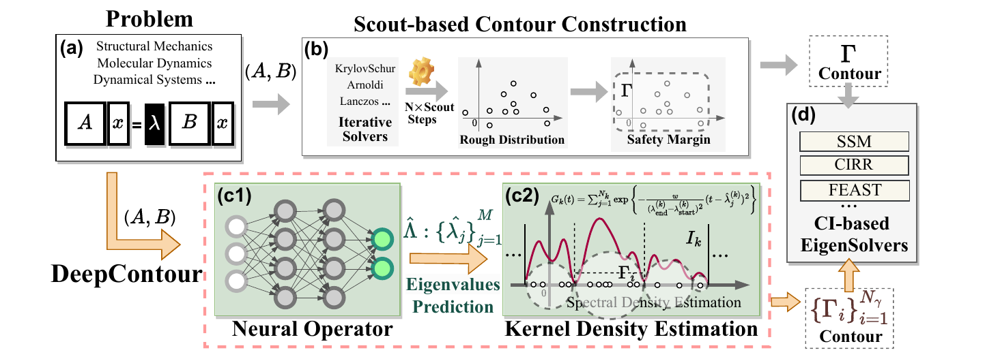
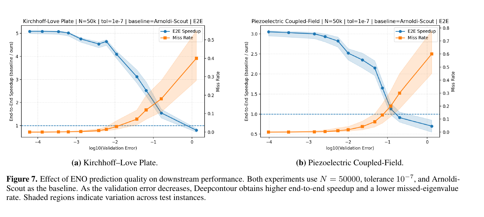

<div align="center">

# DeepContour: Learning-Guided Integration Contours Construction for Fast Large-Scale Generalized Eigensolvers

Yeqiu Chen · Ziyan Liu · Hong Wang · Lei Liu

**ICML 2026**

[Dataset Generator](https://github.com/WanyeJJ/GEPBench) · [Citation](#citation)

</div>

## News

- **August 2026:** The official DeepContour project page is now available.
- **Coming soon:** We are organizing the implementation and will release the complete code in this repository.

## Introduction

DeepContour is a learning-guided framework for constructing integration contours in large-scale generalized eigensolvers. It predicts the target spectral distribution, identifies suitable spectral partitions, and constructs compact contours for contour-integral eigensolvers.

## Method

<p align="center">
  
</p>

DeepContour combines an Eigen Neural Operator with adaptive contour construction. The predicted eigenvalue distribution guides balanced spectral partitioning and contour placement, reducing unnecessary linear solves while preserving the target eigenvalue coverage.

## Prediction Quality

<p align="center">
  
</p>

The quality of the predicted spectral distribution directly affects contour compactness, computational efficiency, and eigenvalue coverage.

## Code

The implementation is being organized and verified for reproducibility. The complete training and solver code will be released here when it is ready.

## Citation

```bibtex
@inproceedings{chen2026deepcontour,
  title={Learning-Guided Integration Contours Construction for Fast
         Large-Scale Generalized Eigensolvers},
  author={Chen, Yeqiu and Liu, Ziyan and Wang, Hong and Liu, Lei},
  booktitle={International Conference on Machine Learning},
  year={2026}
}
```

## Contact

For questions or discussion, please contact Hong Wang at [wanghong1700@mail.ustc.edu.cn](mailto:wanghong1700@mail.ustc.edu.cn).
